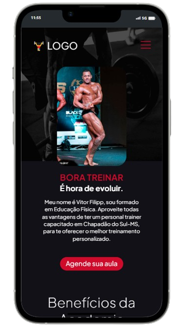

# Projeto para Personal Trainer 👨‍🔧
Projeto que desenvolvi para o Personal Trainer conseguir mostrar sua carreira, serviços, contatos e o cliente conseguir agendar aula depois de ter passado muito mais credibilidade e profissionalismo com o site. 👨‍🔧

 

## Demonstração da seção home em desktop:

 

#
## Mobile:

 

#
## Tecnologias utilizadas:
- HTML
- CSS
- JS

(Botão menu hamburguer com animação)

#
